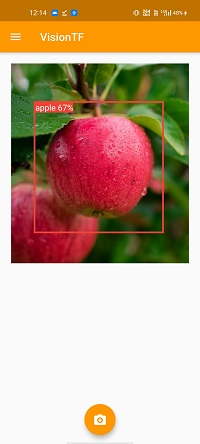
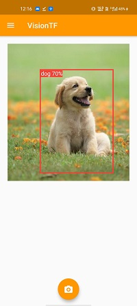
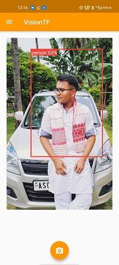

# VisionTF

This is a  Flutter Project which is integrated with tenserflowlite to detect objects in images. Here I have used two pretrained models that is ssdmobile net and yolov2_tiny.

## Getting Started

Some of the screenshots are below :

    
  
